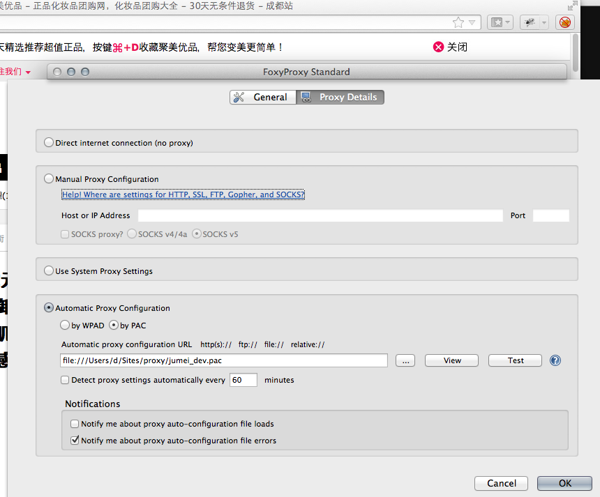
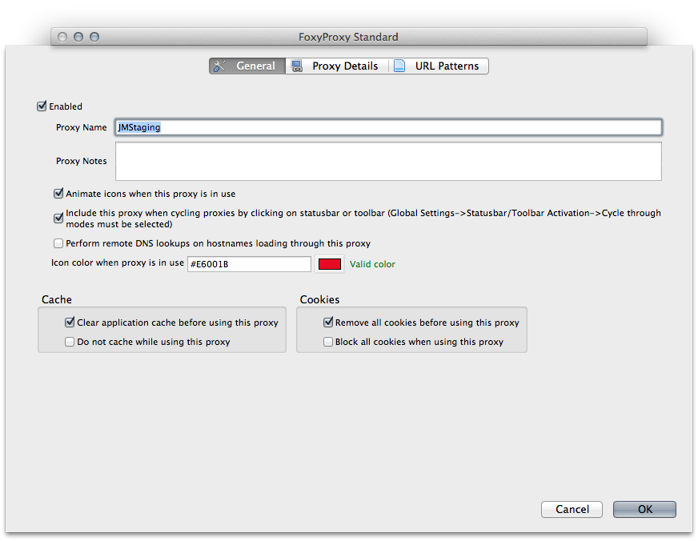
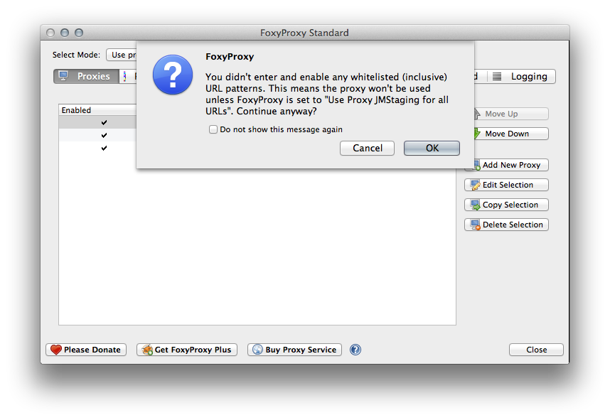
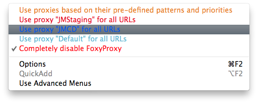
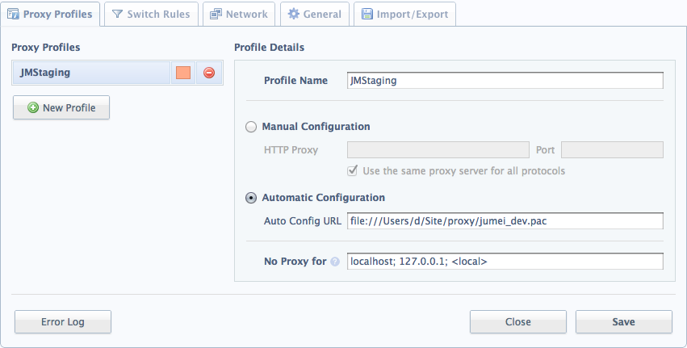
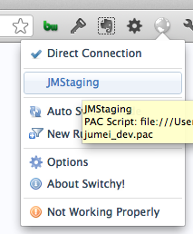

Staging 切换
-----------

## Requirements

- FoxyProxy on Firefox
- Switchy on Chromium / Chrome

## Installation
- FoxyProxy
    - Firefox -> Tools -> Add-ons -> Get Add-ons -> Search: FoxyProxy
- Switchy
    - Chromium -> Goto: <https://chrome.google.com/webstore/category/home> -> Search: Proxy Switchy [from Mhd Hejazi]

## Setup
PAC URL: `http://raw.github.com/XXX`

不建议使用本地 PAC 文件，以上 PAC 会定期更新。

### 先以 FoxyProxy 为例说明：

1. 点击右上方狐狸头，弹出配置对话框，点击其中 Add New Proxy 按钮

    

    选择 Automatic Proxy Configuration by PAC，填入以上 PAC URL
    
2. 选择 General，填入 Proxy Name，这里以 JMStaging 为例

    

3. 点击 OK 进行确认

    

4. 右键点击右上方狐狸头，选择 JMStaging 配置即可

    

### 以下为 Switchy 的配置说明：

1. 点击 Switchy 图标进入配置

    
    点击左侧 New Profile，填入配置内容。配置方法于 FoxyProxy 类似。

2. 点击 Switchy 图标，选择 Profile

    

### Safari on Mac 使用手册

自问：Safari 简单为美，没有乱七八糟的插件，怎么搞？

自答：APP !!!

    git clone xxx
    script/Switcher.app

拖到 Dock 上，执行后提示输入管理员密码，不要怕，这里没有任何文件操作，也没有后台进程，修改系统配置，Apple 必须要求管理员授权。

第一次执行为启动，第二次执行为关闭。目前还没有提供 Profile 可供选择。